# LEXASSIST - (Automating Legal Intelligence: Design and Implementation of a Multi-Agent LLM System for Legal Clause Analysis and Risk Detection)

**Author:** Shruthi Ravi

**Dataset**: The Legal-Clause -> 395 legal datasets (Kaggle) 

**Framework**: Supervisor coordinated multi agent system built through LangGraph, FastAPI and Streamlit with retrieval grounded in ChromaDB vector database. 

**Task:** **Following are the list of situations faced by people through legal lens every single day**
```
Scenario 1 -> A startup CEO is about to sit down with an investor to negotiate a term sheet.
Her legal advisor is out sick and unreachable.
She isn't trained to read clauses like liquidation preference or indemnification,
and has no way to tell whether what's on the page is standard or unusually aggressive.
```
```
Scenario 2 -> An international student misses a rent payment after an unexpected financial setback.
His landlord sends a notice threatening legal action.
The student has never read a lease closely, doesn't know what a "default clause" or "cure period" means,
can't afford a lawyer, and is now worried this could spiral into a court case or affect his visa status.
```
As above mentioned scenarios, legal documents such as contracts, policies and amendments are often long, complex and difficult to interpret in real time, especially under time pressure. Existing legal resources are not designed for instant querying, structured understanding or risk evaluation. Sometimes these scenes require high trained professional lawyers leading to financial constraints. By considering all the above situations, LEXASSIT was developed for consumers to close that gap. It instantly searches, analyses and summarizes the real world clauses, enabling faster, more informed decisions without requiring legal assistance.

## What It Does?
+ **Classifies** the document or query, figures out the kind of document or legal clause it is spread across the dataset.
+ **Retrieves** relevant context by pulling out the similar clauses and reference material from ChromaDB vector store built with datasets as the base leading through solutions match the actual data.
+ **Assesses** **risk** by flagging whether a clause is unusual, aggressive or questionable.
+ **Summarizes** reproduces the whole document into simple terms covering its whole information, obligations, risk and options to use as per consumer's needs.

## Architecture

### PHASE 1 

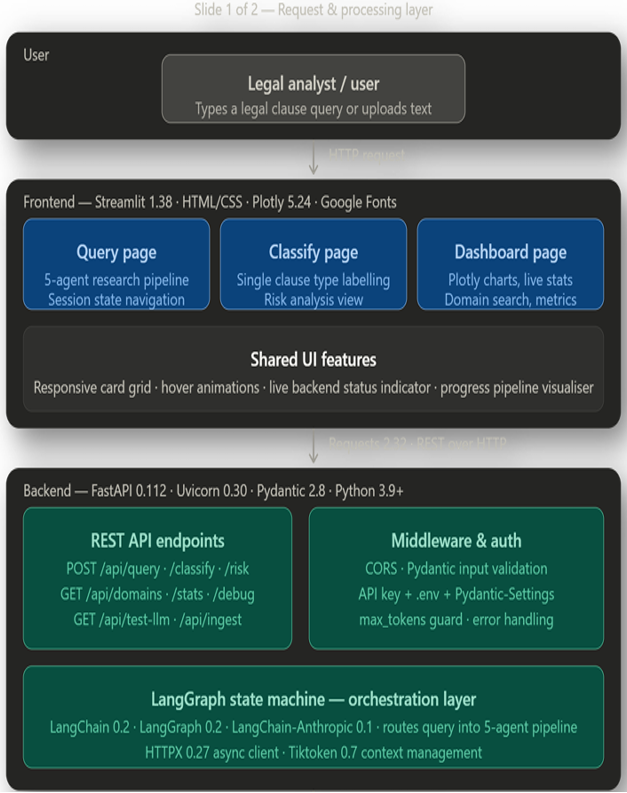

### PHASE 2
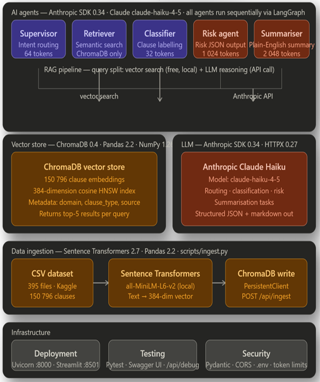

## Tech Stack
| Category | Tools |
|---|---|
|Orchestration| LangGraph(supervisor through multi agent system)|
|Agents| Supervisor, Classifier, Retriever, Risk Analyzer, Summarizer|
|LLM| Claude Haiku API |
|VectorDB| ChromaDB|
|Backend & Frontend| Python|

## Project Structure

```
LexAssist/
├── app/
│   ├── agents/
│   │   ├── __init__.py
│   │   ├── classifier_agent.py
│   │   ├── retriever_agent.py
│   │   ├── risk_agent.py
│   │   ├── summarizer_agent.py
│   │   └── supervisor.py
│   ├── api/
│   │   ├── __init__.py
│   │   └── routes.py
│   ├── graph/
│   │   ├── __init__.py
│   │   ├── legal_graph.py
│   │   └── state.py
│   ├── models/
│   │   ├── __init__.py
│   │   └── schemas.py
│   ├── tools/
│   │   ├── __init__.py
│   │   ├── csv_loader.py
│   │   ├── legal_tools.py
│   │   └── vector_store.py
│   ├── __init__.py
│   ├── config.py
│   └── main.py
├── scripts/
│   └── ingest.py
├── tests/
│   ├── __init__.py
│   ├── test_agents.py
│   ├── test_api.py
│   ├── test_csv_loader.py
│   ├── test_graph.py
│   └── test_vector_store.py
├── .env.example
├── .gitignore
├── DSC550_FinalPresentation_ShruthiRavi.pptx
├── DSC550_MasterProjectReport_ShruthiRavi.pdf
├── LexAssist_Classifier1.png
├── LexAssist_Classifier2.png
├── LexAssist_Dashboard.png
├── LexAssist_DocSearch.png
├── LexAssist_LegalResearch1.png
├── LexAssist_LegalResearch2.png
├── LexAssist_Phase1.png
├── LexAssist_Phase2.png
├── LexAssist_RiskAnalyzer1.png
├── LexAssist_RiskAnalyzer2.png
├── LexAssist_Webpage.png
├── README.md
├── requirements.txt
└── streamlit_app.py
```

## Setup

```sh
# Clone the repository
git clone <YOUR_GIT_URL>

# make necessary installations
pip install -r requirements.txt

# Running python scripts
Run `python scripts/ingest.py`

# Start the development server
Run `uvicorn app.main:app --reload --port 8000
```

## Outputs
#### a) Webpage -> Contributes the overall sections of clauses indexed, number of domains in datasets, active agents, and a dataset browser. 
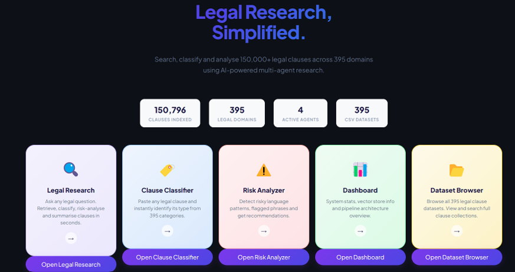

#### b) Legal Research -> A sample clause / a human query is given to show the actual working of this agent, which provides the overview of the summary along with its key points, risk identification, recommended actions, clause type, and similar references to other domains and clauses. 
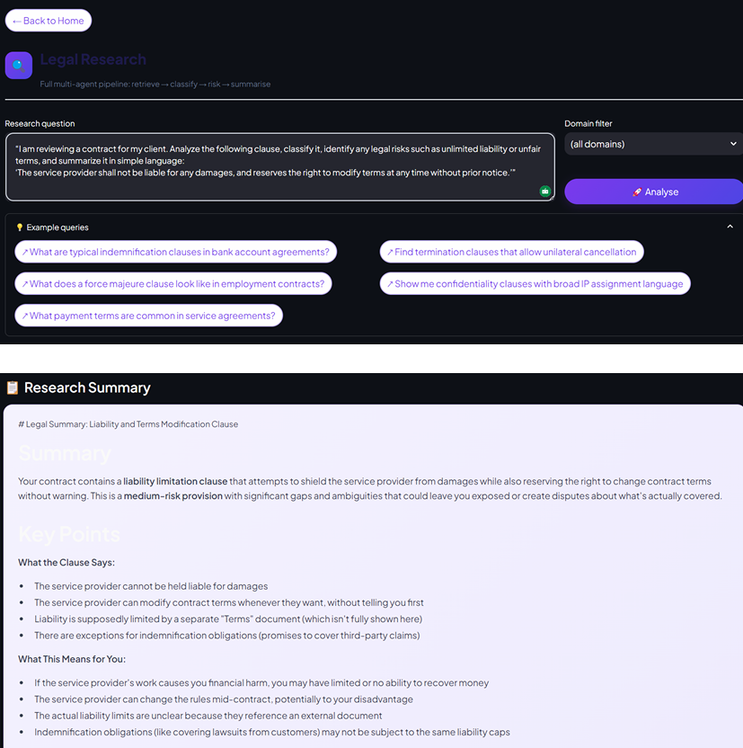

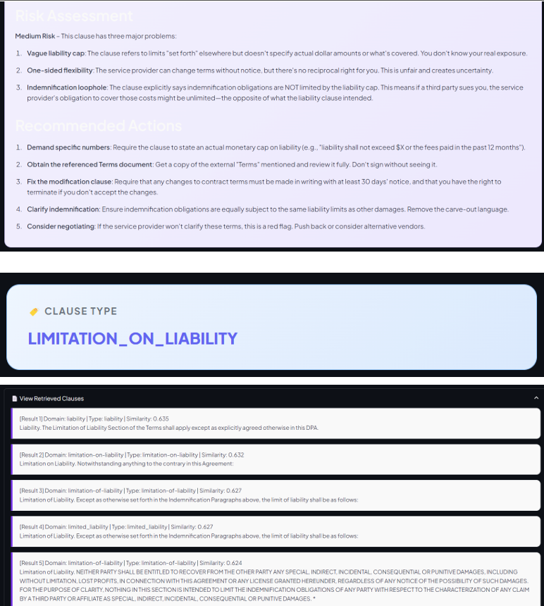

#### c) Legal Classifier -> A sample clause / a human query is given to show the actual working of this agent; this whole section comprises the classification of a given clause along with recommendations for attorneys, compliance teams, executives, and consumers through sample datasets, example use cases, and questions.
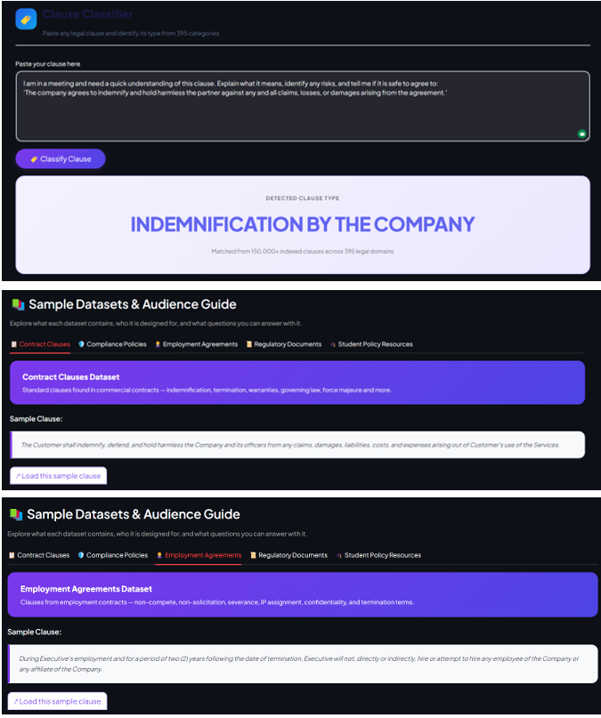

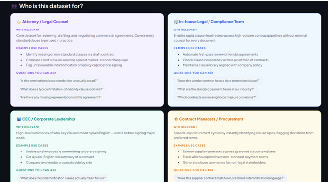

#### d) Risk Analyzer -> This module performs a comprehensive evaluation of overall risk by identifying contributing factors, highlighting flagged phrases, and generating actionable recommendations to support informed decision-making. 
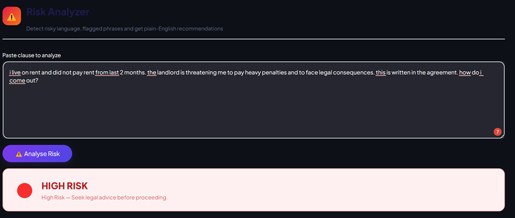

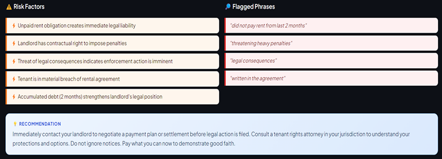

#### e) Dashboard -> Shows the overall statistics of all the agents
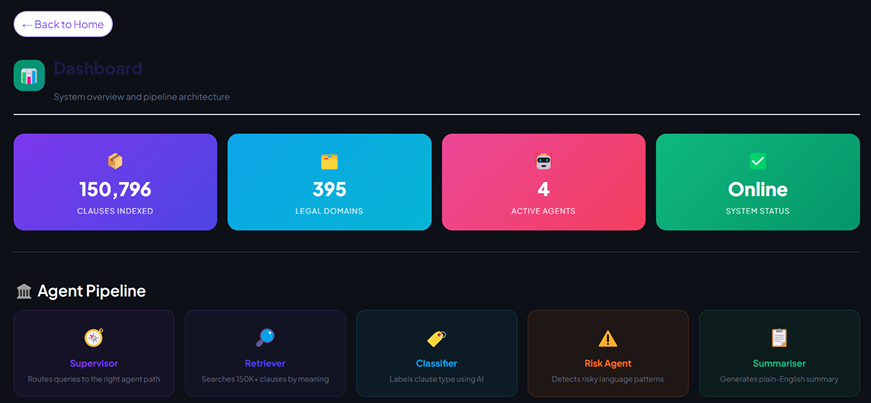

#### f) Document Search Engine -> easy search engine for the user to check or look through datasets
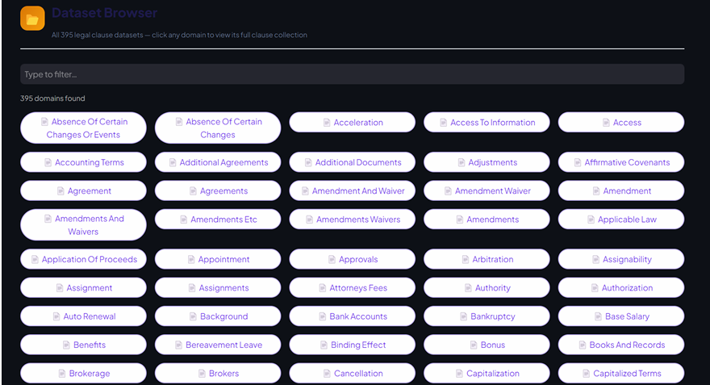

## Limitations

+ No user authentication or role-based access such as single-user, local only
+ No persistent query history or session storage
+ Lower classification accuracy on novel or jurisdiction-specific clauses
+ Dependent on Claude API that are tied to its availability, latency, and cost
+ Only plain text input, no native PDF/DOCX ingestion

## Future Work

+ PDF/DOCX ingestion with parsing for multi-page docs and tables
+ User authentication and session management (JWT-based)
+ Fine-tuned transformer classifier (e.g. BERT) on the 395-category corpus
+ Clause comparison across contracts/domains
+ Jurisdiction-based filtering for region-specific legal context
